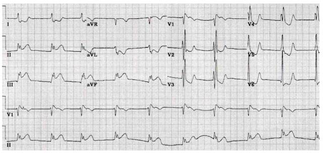
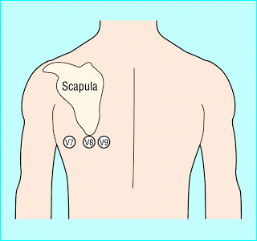

---

title: 'ECG Right and Posterior Leads'
authors:
    - 'Michelle Lin, MD'
created: 2011/03/11
updates: null
categories:
    - Cardiovascular
    - ECG
drugs: null

---

# ECG: Right and Posterior Leads

****

Right sided EKG leads (V1R-V6R) are positioned in a mirror image fashion to the standard 12-lead precordial leads.

-   **Purpose:** To detect right ventricular (RV) infarcts
-   RV infarcts usually associated with inferior wall AMI
-   **Indications**: 2004 ACC/AHA guidelines state to get a **right-sided EKG** in setting of **inferior AMI (**ST elevation in II, III, **** AVF)** **

Hints that there is an associated RV infarct:

1.  Hypotension (RV infarcts are extremely preload dependent) 
2.  STE in III is taller than ST elevation in II
3.  STE in V1
4.  ST depression (STD) in V2 or V3 relative to V1 

## Posterior EKG leads

**
**Posterior EKG leads (V7-V9) are applied by moving V4-V6 to under the left scapula.
**Purpose:** To detect posterior infarcts
Posterior AMI often associated with inferior or lateral wall AMI
**Indications:** 
-   STD in V1-V3, or 
-   R/S amplitude ratio in V1 or V2 is &gt; 1 

Hints that there is an associated posterior infarct:
1.  Deep T wave inversion in V1 or V2 (in hyperacute stage) 
2.  Upright T wave waves (in later stage)
