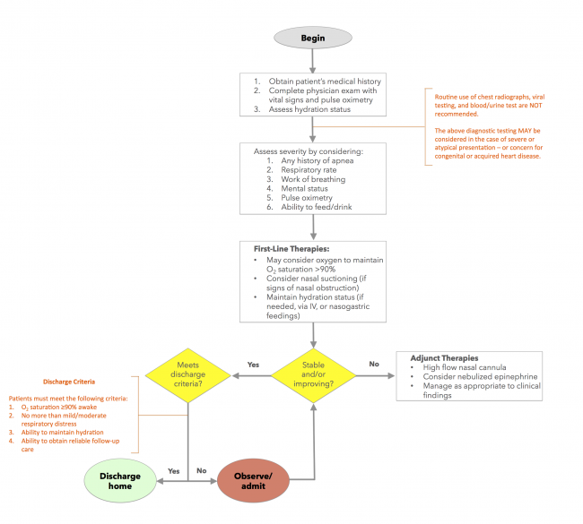

---

title: Acute Bronchiolitis Management
authors:
    - Michelle Lin, MD
created: 2016/11/07
updates:
categories:
    - Pediatrics
    - Pulmonology
    - Infectious Disease
---

# Acute Bronchiolitis Management

## How to Use Algorithm

### Scope

Does not apply if severe or atypical presentation

### Inclusion Criteria

Children, 1‐12 months of age, presenting with symptoms and signs suggestive of a clinical diagnosis of bronchiolitis, such as upper respiratory tract infection such as rhinitis and coughing, progressing to lower respiratory symptoms including wheezing, crackles, and/or tachypnea that may result in difficulty breathing and/or difficulty feeding

### Exclusion Criteria

- Full‐term infants that are &lt;28 days old
- Premature infants that are &lt;48 weeks post‐conception
- Patients with hemodynamically significant cardiac or significant pulmonary disease (such as bronchopulmonary dysplasia or asthma) or other major chronic conditions (such as immunodeficiency and neuromuscular disease)

## History & Physical

1. Obtain patient's medical history
2. Complete physical exam with vital signs and pulse oximetry
3. Assess hydration status

## Assess Severity

Assess severity by considering:

- Any history of apnea
- Respiratory rate
- Work of breathing
- Mental status
- Pulse oximetry
- Ability to feed/drink

> Routine chest xray, viral testing, and blood or urine testing are **NOT** recommended
> The above diagnostic testing **MAY** be considered in the case of severe or atypical presentation or if concern for congenital or acquired heart disease

## First Line Therapies

- May consider supplemental oxygen to maintain SpO2 > 90%
- Consider nasal suctioning (if signs of nasal congestion)
- Maintain hydration status (if needed via IV or nasogastric feedings)

## If Patient is stable and/or improving

Discharge home if patient meets following criteria.

### Discharge Criteria (must meet all requirements)

1. O2 saturation &ge; 90% while awake
2. No more than mild/moderate respiratory distress
3. Ability to maintain hydration
4. Ability to obtain reliable follow-up care

If patient does not meet all criteria, continue to observe and reassess.

## If Patient NOT stable or improving

Consider the following adjunct therapies

- High flow nasal canula
- Nebulized epinepherine
- Manage as appropriate to clinical findings

## References

1. Ralston S, Lieberthal A, Meissner H, et al. Clinical practice guideline: the diagnosis, management, and prevention of bronchiolitis. Pediatrics. 2014;134(5):e1474-502. [PubMed](https://www.ncbi.nlm.nih.gov/pubmed/25349312)
