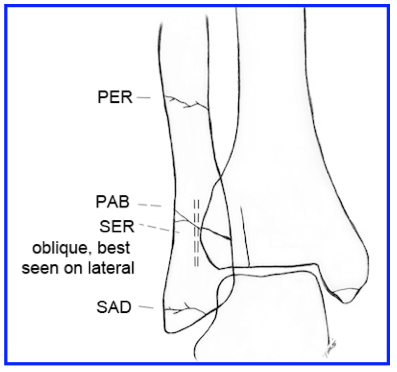
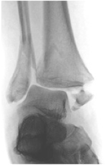
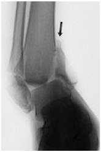

---

title: 'Ankle Fractures: Lauge-Hansen Classification'
authors:
    - Michelle Lin, MD
created: 2010/02/18
updates: null
categories:
    - Orthopedics

---

# Ankle Fractures: Lauge-Hansen Classification

**Lauge-Hansen Classification: **

-   Describes position of foot and mechanism of injury
-   Fracture(s) progress from Stage 1--&gt; 4 involving more areas
-   Each type of fracture type has classic radiographic appearance

**4 areas of injury:**

-   Anterior talofibular ligament (AFTL) tear
-   Lateral malleolus (LM) fx
-   Posterior malleolus (PM) fx, or posterior talofibular ligament (PTFL) tear
-   Medial malleolus (MM) fx, or deltoid ligament tear

\*Often fibula fx pattern hints at classification 

## Supination-External Rotation (SER) 

40-75% of all ankle fractures 

-   *Stage 1*: ATFL tear
-   *Stage 2:* Spiral oblique distal fibula fx at ankle mortise level 
-   *Stage 3*: PM fx or PTFL tear
-   *Stage 4*: Transverse MM fx or deltoid ligament tear

## Supination-Adduction (SAD) 

 10-20% of all ankle fractures 

-   *Stage 1*: Low avulsion LM fx or lateral ligament injury
-   *Stage 2*: Vertical shear fx of MM

## Pronation-Abduction (PAB)

 5-20% of all ankle fractures

-   Associated with syndesmosis instability
-   *Stage 1*: Transverse MM fx (or deltoid ligament tear) 
-   *Stage 2*: ATFL or PTFL tear
-   *Stage 3*: Transverse fibula fx at or above ankle mortise
-   Typically fibula fx has butterfly segment (comminuted)

## Pronation-External Rotation (PER) 

7-19% of all ankle fractures 

-   Maisonneuve fx is a type of PER injury
-   Associated with syndesmosis instability
-   *Stage 1*: Transverse MM fx (or deltoid ligament tear) 
-   *Stage 2*: ATFL tear
-   *Stage 3*: Spiral oblique fibula fx above ankle mortise 
-   *Stage 4*: PM fx or PTFL tear
-   To diagnose deltoid ligament instability, use “gravity stress” view (lateral portion of ankle rests on xray table to increase medial mortise)
-   Operative repair depends on talar stability under tibial plafond. A 1 mm lateral talar shift causes loss of joint surface contact by 42% --&gt; chronic arthritis complications 

## References

-   [Clare MP. A rational approach to ankle fractures. Foot Ankle Clin. 2008 Dec;13(4):593-610. doi: 10.1016/j.fcl.2008.09.003.](https://www.ncbi.nlm.nih.gov/pubmed/19013398)
