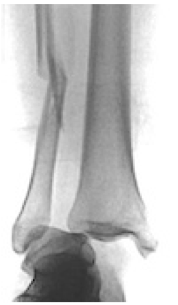

---

title: 'Ankle Fractures: Lauge-Hansen Classification'
authors:
    - Michelle Lin, MD
created: 2010/02/18
updates:
categories:
    - Orthopedics
---

# Ankle Fractures: Lauge-Hansen Classification

## Lauge-Hansen Classification

- Describes position of foot and mechanism of injury
- Fracture(s) progress from Stage 1--> 4 involving more areas
- Each type of fracture type has classic radiographic appearance

### 4 areas of injury

- Anterior talofibular ligament (AFTL) tear
- Lateral malleolus (LM) fx
- Posterior malleolus (PM) fx, or posterior talofibular ligament (PTFL) tear
- Medial malleolus (MM) fx, or deltoid ligament tear

\*Often fibula fx pattern hints at classification 

### Supination-External Rotation (SER) 

40-75% of all ankle fractures 

- _Stage 1_: ATFL tear
- _Stage 2:_ Spiral oblique distal fibula fx at ankle mortise level 
- _Stage 3_: PM fx or PTFL tear
- _Stage 4_: Transverse MM fx or deltoid ligament tear

### Supination-Adduction (SAD) 

 10-20% of all ankle fractures 

- _Stage 1_: Low avulsion LM fx or lateral ligament injury
- _Stage 2_: Vertical shear fx of MM

### Pronation-Abduction (PAB)

 5-20% of all ankle fractures

- Associated with syndesmosis instability
- _Stage 1_: Transverse MM fx (or deltoid ligament tear) 
- _Stage 2_: ATFL or PTFL tear
- _Stage 3_: Transverse fibula fx at or above ankle mortise
- Typically fibula fx has butterfly segment (comminuted)

### Pronation-External Rotation (PER) 

7-19% of all ankle fractures 

- Maisonneuve fx is a type of PER injury
- Associated with syndesmosis instability
- _Stage 1_: Transverse MM fx (or deltoid ligament tear) 
- _Stage 2_: ATFL tear
- _Stage 3_: Spiral oblique fibula fx above ankle mortise 
- _Stage 4_: PM fx or PTFL tear
- To diagnose deltoid ligament instability, use “gravity stress” view (lateral portion of ankle rests on xray table to increase medial mortise)
- Operative repair depends on talar stability under tibial plafond. A 1 mm lateral talar shift causes loss of joint surface contact by 42% --> chronic arthritis complications 

## References

- Clare MP. A rational approach to ankle fractures. Foot Ankle Clin. 2008 Dec;13(4):593-610. [PubMed](https://www.ncbi.nlm.nih.gov/pubmed/19013398)
