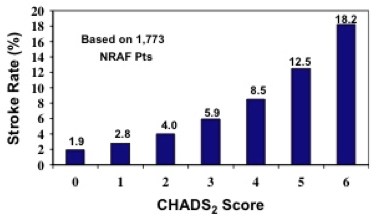

---

title: Atrial Fibrillation and Anticoagulation
authors:
    - Michelle Lin, MD
created: 2010/04/09
updates:
    - 2017/02/13
categories:
    - Cardiovascular
---

# Atrial Fibrillation and Anticoagulation

## Background

**Atrial Fibrillation** (AF) = **5x** risk for CVA and increases with age 

- Patients with persistent and paroxysmal atrial fibrillation should be treated the same when it comes to deciding about anticoagulation. They have an equivalent risk of stroke.

**Stroke risk factors for patients with AF: **

- Prior CVA or TIA
- HTN
- Age ≥75
- CHF
- Poor LV function
- DM

## CHADS2 stroke risk stratification scheme 

- **C** = Congestive heart failure (1 pt)
- **H** = Hypertension (1 pt)
- **A **= Age ≥ 75 (1 pt)
- **D **= DM (1 pt)
- **S2** = prior Stroke or TIA (2 pts)

([Gage et al., JAMA, 2001](https://www.ncbi.nlm.nih.gov/pubmed/?term=11401607))

## Deciding on whether to anticoagulate with aspirin or warfarin: ([AHA/ACC/ESC 2006 guidelines](http://circ.ahajournals.org/content/114/7/e257.full))

### WEAK RISK FACTORS

- Female gender    
- Age 65-74 years        
- Coronary artery disease               
- Thyrotoxicosis

**Treatment**

- Aspirin or warfarin

### MODERATE RISK FACTORS

- Age > 75 years          
- Hypertension                     
- Heart failure           
- LV ejection fracture ≤35%              
- Diabetes mellitus 

**Treatment**

- 1 risk factor: aspirin or warfarin
- \> 1 risk factor: warfarin

### HIGH RISK FACTORS

- Prior CVA        
- Prior TIA         
- Embolism          
- Mitral stenosis   
- Mech heart valve

**Treatment**

- Warfarin

## Notes

- Anticoagulation goal with warfarin: INR 2-3
- If age &lt;60 years AND zero risk factors: No anticoagulation because low risk for CVA 

## References

- Fuster V, Rydén LE, Cannom DS, et al. ACC/AHA/ESC 2006 Guidelines for the Management of Patients with Atrial Fibrillation: a report of the American College of Cardiology/American Heart Association Task Force on Practice Guidelines and the European Society of Cardiology Committee for Practice Guidelines (Writing Committee to Revise the 2001 Guidelines for the Management of Patients With Atrial Fibrillation): developed in collaboration with the European Heart Rhythm Association and the Heart Rhythm Society. Circulation. 2006;114(7):e257-354. [PubMed](https://www.ncbi.nlm.nih.gov/pubmed/16908781)
- Waldo AL. Anticoagulation: Stroke Prevention in Patients with Atrial Fibrillation. Cardiol Clin 2009; 27:125-35. [PubMed](https://www.ncbi.nlm.nih.gov/pubmed/?term=19111769)
- Gage BF, Waterman AD, Shannon W, Boechler M, Rich MW, Radford MJ. Validation of clinical classification schemes for predicting stroke: results from the National Registry of Atrial Fibrillation. JAMA. 2001 Jun 13;285(22):2864-70. [PubMed](https://www.ncbi.nlm.nih.gov/pubmed/?term=11401607)
