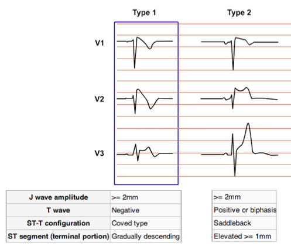

---

title: Brugada Syndrome
authors:
    - Michelle Lin, MD
created: 2011/05/06
updates: null
categories:
    - Cardiovascular
---

# Brugada Syndrome

- Genetically linked, cardiac sodium channelopathy
- High risk for sudden death in young, healthy adults because VTach/VFib 
- Mean age of sudden death = 41 ± 15 years
- Higher prevalence in males and Asian descent
- Atrial fibrillation associated in 10-20% cases

## EKG findings

- 3 types
- Type 1 – Most specific for Brugada Syndrome
- Highest risk for symptoms of syncope and sudden death

## Differential diagnosis

|                                       |                                       |
| ------------------------------------- | ------------------------------------- |
| After electrical cardioversion        | Friedreich ataxia                     |
| Arrhythmogenic RV dysplasia           | Early repolarization, esp in athletes |
| Atypical right BBB                    | Hypothermia                           |
| Acute MI, especiall RV infarct        | Pericardial effusion                  |
| Acute myopericarditis                 | Pulmonary embolism                    |
| Compression of RV outflow tract       | Left ventricular hypertrophy          |
| Disorder of central/auton nerv system | Mediastinal tumor                     |
| Dissecting aortic aneurysm            | Pectus excavatum                      |
| Duchenne muscular dystrophy           |                                       |

## Treatment

**Indications for implantable cardiac defibrillator**

**Brugada Type 1 PLUS one of following:**

- Aborted sudden cardiac death
- Syncope, seizure, or noctural agonal respirations without alternative cause
- Family hx of sudden cardiac death (likely from Brugada) AND positive electrophysiology (EPS) study 
- A positive EPS study

Otherwise, close followup with cardiologist.

## References

- Antzelevitch C, Brugada P, Borggrefe M, Brugada J, Brugada R, Corrado D, Gussak I, LeMarec H, Nademanee K, Perez Riera AR, Shimizu W, Schulze-Bahr E, Tan H, Wilde A. Brugada syndrome: report of the second consensus conference: endorsed by the Heart Rhythm Society and the European Heart Rhythm Association.Circulation. 2005 Feb 8;111(5):659-70. Epub 2005 Jan 17. [PubMed](https://www.ncbi.nlm.nih.gov/pubmed/?term=15655131)
