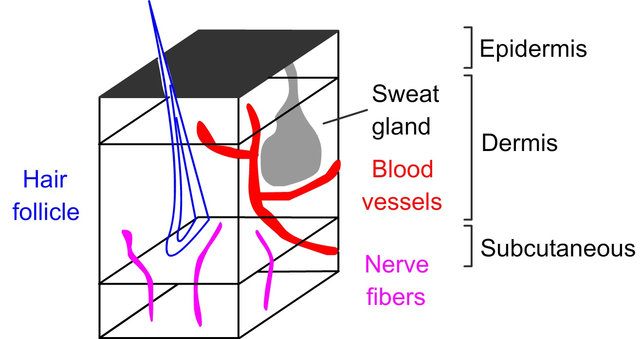
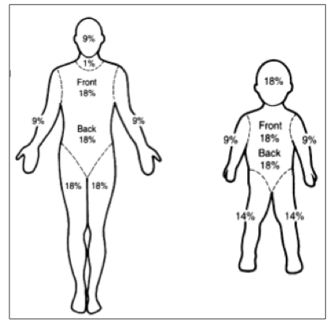

---

title: Burn Wounds
authors:
    - Michelle Lin, MD
    - Christian Rose, MD
created: 2010/07/02
updates:
    - 2016/04/22
categories:
    - Trauma
---

# Burn Wounds

## American Burn Association Classification (2009)

**Superficial**: EPIDERMIS depth only; painful

**Partial-Thickness:** involve dermis

- **Superficial**
  - EPIDERMIS + SHALLOW DERMIS
  - Moist, blistering; skin blanches, very painful
  - Heals within 3 weeks
- **Deep**
  - EPIDERMIS + DEEP DERMIS
  - Looks between superficial partial-thickness and 3rd degree burn
  - May need skin graft
  - Heals in >3 weeks

**Full-Thickness:** 

- EPIDERMIS + ENTIRE DERMIS
- Dark brown, charred, skin does not blanch
- Site insensate because burned nerve fibers
- Needs skin graft

## Total body surface area (TBSA)

- Rule of 9’s
- Patient’s palm and fingers = 1% TBSA
- In calculating TBSA % burn, do not include 1st degree burns

## Burn unit referral

- Partial thickness >10% TBSA
- Burns of face, hands, feet, genitalia, perineum, major joints
- Full thickness burn
- Electrical or chemical burn
- Inhalational injury
- Patient with co-morbidities
- Special considerations: Social, emotional, or long-term rehab intervention

**Fluid resuscitation** = 4 cc/kg/% TBSA of Lactated Ringers over 24 hrs with half given in first 8 hrs

- Titrate to urine output

| Age           | Target urine output |
| ------------- | ------------------- |
| Adults        | 30-50 cc/hr         |
| Age > 2 yr    | 0.5-1 cc/kg/hr      |
| Age &lt; 2 yr | 1-2 cc/kg/hr        |

- Start if &gt;20% TBSA involvement

## Burn Management

**Minor burns:**

- Tetanus update
- Pain medications
- Debride dead skin, +/- unroof blisters >2 cm diameter
- Apply topical antimicrobial/dressing
- 24 hr follow-up

**Large burns** – Apply topical antimicrobial agent such as **bacitracin**, **neomycin**, **mupirocin**, or **honey**. Membrane-based dressings can be used alternatively.

**Practice Change:** **Silver sulfadiazine** has fallen out favor for burn prophylaxis in partial-thickness burns. May slow wound healing, increases frequency of dressing changes, and more painful

**What is high voltage injury?** &gt; 1000 volts

## References

- Gomez R et. al. Management of burn wounds in the emergency department.Emerg Med Clin North Am. 2007 Feb;25(1):135-46. [[PubMed](http://www.ncbi.nlm.nih.gov/pubmed/?term=Gomez+Cancio+Emerg+Med+Clin+of+N+Am+2007)]
- Int Wound J. 2010 [[PubMed](https://www.ncbi.nlm.nih.gov/pubmed/?term=20649832)]
- Cochrane Database Syst Rev 2015 [[PubMed](https://www.ncbi.nlm.nih.gov/pubmed/?term=25742878)] 
