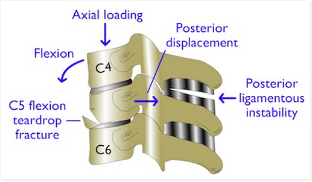

---

title: C3-C7 Spine Fractures
authors:
    - Michelle Lin, MD
created: 2010/10/01
updates: null
categories:
    - Orthopedics
---

# Fractures, C3-C7 Spine

## Articular mass fractures

| Mechanism        | Stable |
| ---------------- | ------ |
| Flexion-rotation | Yes    |

-   Associated with transverse process and vertebral body fractures
-   Uncommon

## Burst fractures

| Mechanism         | Stable |
| ----------------- | ------ |
| Axial compression | Yes/No |

-   Compressive fracture of the anterior and posterior vertebral body
-   _Complication_: Spinal cord injury because of retropulsed vertebral body fragment (especially anterior cord syndrome)

## Spinous process fracture (“Clay Shoveler’s" fracture)

| Mechanism | Stable |
| --------- | ------ |
| Flexion   | Yes    |

-   Spinous process fracture from forceful neck flexion
-   Most commonly occurs in lower cervical levels (C7)
-   Not associated with neurologic injury

## Extension teardrop fracture

| Mechanism | Stable |
| --------- | ------ |
| Extension | No     |

-   See Fracture, C1 and C2 spine topic
-   Most commonly occurs at C2

## Facet dislocation, bilateral

| Mechanism | Stable |
| --------- | ------ |
| Flexion   | No     |

-   Significant anterior displacement (>50%) of spine when bilateral inferior facets displace anterior to the superior facets below
-   At risk for injuring anterior and posterior longitudinal ligament, disk, vertebral arteries, and spinal cord

## Flexion dislocation, unilateral

| Mechanism        | Stable |
| ---------------- | ------ |
| Flexion-rotation | Yes    |

-   Usually causes 25-50% anterior displacement of spine
-   Complication: Vertebral artery injury (CT angiography recommended)

## Flexion teardrop Fracture

| Mechanism              | Stable |
| ---------------------- | ------ |
| Flexion and axial load | No     |

-   Fracture and anterior displacement of anteroinferior vertebral body (appears similar to extension teardrop fracture, except much more unstable)
-   Rupture of both anterior & posteior ligamentous complexes 
-   Unique findings for flexion (versus extension) teardrop fx: Same-level fxs, displacement of posterior structures
-   Regarded as ONE OF THE MOST UNSTABLE FX's in the lower cervical spine, because involves both columns 
-   Usually occurs at C5 or C6

## Subluxation, anterior

| Mechanism | Stable |
| --------- | ------ |
| Flexion   | No     |

-   Ruptured posterior ligamentous complex, such that anterior and posterior vertebral lines are disrupted
-   Complication: vertebral artery dissection (CT angiography recommended)
-   May only be evident during flexion views by conventional xray; the interspinous distance widens and the vertebral body subluxes anteriorly

## Transverse Process Fracture

| Mechanism       | Stable |
| --------------- | ------ |
| Lateral flexion | Yes    |

-   _Complication_: Vertebral artery injury, because travels within the transverse foramina (CT angio recommended)
-   _Complication_: Cervical radiculopathy and brachial plexus injuries associated in 10% of cases

## Wedge Fracture

| Mechanism | Stable |
| --------- | ------ |
| Flexion   | Yes    |

-   Compression fracture of only the anterosuperior vertebral body endplate
-   Disruption of anterior vertebral line

| **Injury (Mechanism)**                          | **Stable** |
| ----------------------------------------------- | ---------- |
| Articular mass fx (Flexion-rotation)            | Yes        |
| Burst fx (Axial compression)                    | Yes/No     |
| Spinous process fx (Flexion)                    | Yes        |
| Extension teardrop fx (Extension)               | No         |
| Facet dislocation, bilateral (Flexion)          | No         |
| Flex dislocation, unilateral (Flexion-rotation) | Yes        |
| Flexion teardrop fx (Flexion and axial load)    | No         |
| Subluxation, anterior (Flexion)                 | No         |
| Transverse process fx (Lateral flexion)         | Yes        |
| Wedge fx (Flexion)                              | Yes        |

## References

-   [Lin M and Mahadevan S. “Spine and Spinal Cord Injuries” in Adams J et al (eds), Emergency Medicine. New York: Elsevier, 2007](None)
