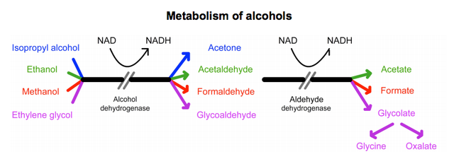

---

title: Toxic Alcohol Ingestion - Ethylene Glycol
authors:
    - Michelle Lin, MD
created: 2012/06/08
updates:
categories:
    - Toxicology
---

# Toxic Alcohol Ingestion: Ethylene Glycol

General concepts for all 3 toxic alcohols

-  Parent compounds (not metabolites) cause high osmolal gap
-  When NAD depleted, pyruvate converts to lactate, which then causes lactic acidosis
-  See metabolism diagram below

## Ethylene Glycol (EG): Factoids

Found in antifreeze, coolants, deicing solutions, ink in stamp pads and ballpoint pens

**Pharmacology**:

- Peak serum concentration 1-4 hours, elimination half-life 3 hours
- Minimum lethal dose 1-1.5 mL/kg 
- Metabolites (eg. oxalate acid) cause toxicity, but do NOT cause osmolal gap

**Labs:** 

- High anion gap metabolic acidosis and high osmolal gap (early in patient course)

## EG: Classic Presentation 

1. Altered mental status
2. Hypocalcemia
3. Oxalate crystals in urine

**Common Signs and Symptoms**

- **Neurologic** – Nausea and vomiting, inebriation with euphoria, nystagmus, ataxia, myoclonic jerks… then CNS depression, hypotonia, seizures, coma
- **Cardiopulmonary** – Hyperventilation from respiratory compensation of acidosis, hypoxia from heart failure, multiorgan failure, ARDS
-  **Renal** – Flank pain, acute tubular necrosis, renal failure

## EG: Management

- **Goal**: Prevent further formation of (fomipezole) & eliminate toxic metabolites (dialysis)
- **Antidote**: Fomipezole inhibits alcohol dehydrogenase (alternative antidote= ethanol)
- **Loading dose**: 15 mg/kg IV
- **Maintenance dose**: 10 mg/kg IV every 12 hours x 2 days 

## EG: American Academy of Clinical Toxicology guidelines

**Indications for treatment of EG poisoning with FOMIPEZOLE: (any of following)**

 - Documented plasma ethylene glycol >20 mg/dL
 \- Documented recent hx of ingesting toxic EG amounts and osmolal gap >10 mOsm/L
 \- Strong suspicion of EG poisoning and at least 2 criteria:

1. Arterial pH &lt;7.3
2. Serum bicarbonate &lt;20 mEq/L
3. Osmolal gap >10 mOsm/L
4. Urine oxalate crystal present

**Indications for treatment of EG toxicity with HEMODIALYSIS: (any of following)**

1. Deteriorating clinical status despite supportive tx PLUS metabolic acidosis (arterial pH &lt; 7.25-7.3)
2. Acute kidney injury with serum Cr > 3 mg/dL or increase in serum Cr by 1 mg/dL
3. Acid-base/electrolyte abnormalities unresponsive to standard tx
4. Old recommendation: EG level > 50 mg/dL

_Note:_ Fomipezole without hemodialysis is an option if normal renal function AND no metabolic acidosis

## Metabolism of Alcohols

## References

- [Marraffa JM, Cohen V, Howland MA. Antidotes for toxicological emergencies: a practical review. Am J Health Syst Pharm. 2012 Feb 1;69(3):199-212. doi: 10.2146/ajhp110014.](https://www.ncbi.nlm.nih.gov/pubmed/?term=22261941)
- [Kraut JF, Kurtz I. Toxic alcohol ingestions: clinical features, diagnosis, and management. Clin J Am Soc Nephrol. 2008 Jan;3(1):208-25. Epub 2007 Nov 28.](https://www.ncbi.nlm.nih.gov/pubmed/?term=18045860)
- [Jammalamadaka D, Raissi S. Ethylene glycol, methanol and isopropyl alcohol intoxication. Am J Med Sci. 2010 Mar;339(3):276-81. doi: 10.1097/MAJ.0b013e3181c94601.](https://www.ncbi.nlm.nih.gov/pubmed/?term=20090509)
