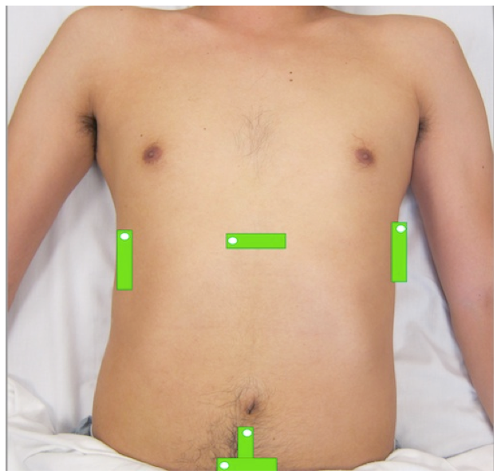
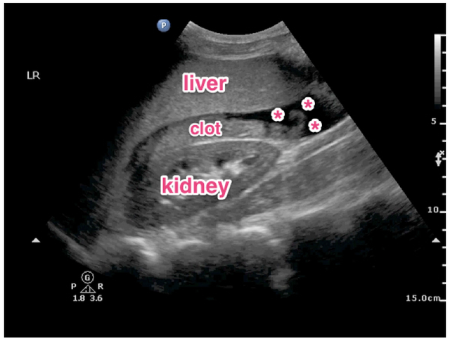
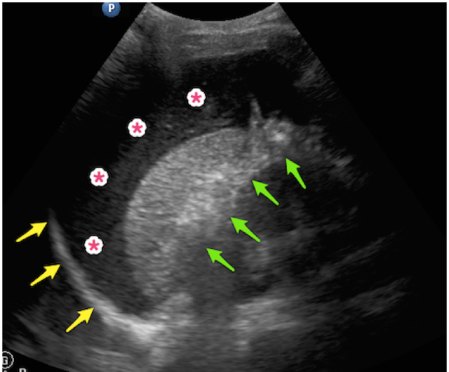

---

title: Focused Assessment with Sonography in Trauma (FAST)
authors:
    - Wilma Chan, MD
    - John Eicken, MD 
    - Mike Stone, MD
created: 2014/09/14
updates: null
categories:
    - Ultrasound
    - Radiology
    - Trauma
---

# Ultrasound: Focused Assessment with Sonography in Trauma (FAST)

**Goals**: Evaluate for free fluid (i.e. blood) in the abdomen, pelvis, thorax, and pericardium in the setting of trauma.

**Transducer**: Low-frequency curvilinear or phased-array

**Windows**:4 windows are obtained to perform a complete FAST exam (Fig 1)

Figure 1: Transducer positions and directional indicator orientation (white dot) for the abdominal and cardiac views in the FAST exam

## Normal Reference Measurements

The FAST exam is dichotomous, yielding either a negative or positive result.  A negative FAST exam is defined by the absence of fluid in all four imaging windows.  A positive FAST exam is defined by the presence, no matter how small, of any amount of fluid in any of the four windows.

A meta-analysis of 62 studies including FAST exams of >18,000 patients revealed a sensitivity of 78.9% and specificity of 99.2% for the identification of intra-peritoneal free fluid (Stengel et al, 2005).

## Right Upper Quadrant (RUQ) View

**Anatomic landmarks:** Right mid-axillary line at the level of the xiphoid process

-   **Initial transducer orientation:** Longitudinal (parallel to exam bed) with directional indicator towards the patient’s axilla.
-   Include the diaphragm, the liver, and the entire right kidney
-   Fan through entire hepatorenal recess (Morison’s pouch), as well as the entire depth and length of the kidney including the inferior pole. 
-   FAST is **POSITIVE** if anechoic free fluid identified in the hepatorenal recess—the potential space between liver and kidney (Fig 2).
-   Fluid cephalad to the diaphragm is in the thoracic cavity, and should raise concern for hemothorax in trauma.

Figure 2: Positive FAST in the RUQ view demonstrating echogenic clot in Morison’s pouch with adjacent anechoic free fluid (\*).

## Left Upper Quadrant (LUQ) View

-   **Anatomic landmarks:** Left posterior axillary line at the level of the xiphoid process.
-   **Initial transducer orientation:** Longitudinal (parallel to exam bed) with directional indicator towards the patient’s axilla.
-   Include the diaphragm, spleen, and entire left kidney
-   Fan through entire LUQ including kidney, spleen tip, and subdiaphragmatic space.
-   FAST is **POSITIVE** if free fluid identified in either the splenorenal recess OR in the subdiaphragmatic space between the spleen and diaphragm
-   Fluid cephalad to the diaphragm is in the thoracic cavity, and should raise concern for hemothorax in trauma.

Figure 3: Positive FAST in LUQ view demonstrating large amount of complex free fluid (\*) below the diaphragm (yellow arrows), despite a lack of fluid in the splenorenal recess (green arrows).

## Pelvic View

-   **Anatomic landmarks**: Suprapubic region at the level of the symphysis pubis.
-   **Initial transducer orientations** (TWO views required):
-   Transverse with the directional indicator oriented to the patient’s right
-   Longitudinal with the directional indicator oriented to the patient’s head
-   Include entire depth of bladder in both views
-   FAST is **POSITIVE** if free fluid is identified posterior to the bladder and/or uterus.

## Cardiac View

-   **Anatomic landmarks**: Subxiphoid space
-   **Initial transducer orientation**: Place the transducer nearly flat below the xyphoid process with the directional indicator oriented to the patient’s right and the probe face directed towards the patient’s left shoulder. Use an overhand grasp on the probe to apply steady downward pressure.
-   Include views of the entire heart with all 4 chambers and surrounding pericardium
-   FAST is **POSITIVE** if free fluid is identified between the heart and pericardial sac. 

## Struggling with the Exam?

**Can’t find the spleen or left kidney?**

-   The left kidney is often located more superior and posterior compared to the right kidney. Try placing the probe more posterior towards the left flank.

**Can’t find the bladder?**

-   Make sure you’re as close to the symphysis pubis as possible (don’t be shy!), and aiming the transducer towards the patient’s feet. Visualization of the bladder is improved prior to emptying of the bladder. Try FAST prior to insertion of a foley catheter or prior to the patient emptying their bladder.

**Rib shadows obstructing view in RUQ and LUQ views?** 

-   Try rotating the transducer obliquely parallel to the ribs in order to fit between an intercostal space. A phased array transducer’s smaller footprint can reduce or eliminate rib shadows.

**Can’t see the entire heart on the subxiphoid view?**

-   Try moving the probe more to the patient’s right to use the liver as an acoustic window. You can also try increasing the depth of the image.

## Common Errors: Failure to&hellip;

-   Fan through entire depth and length of target organs
-   Perform serial FAST exams in patients who develop changes in their vitals or exam
-   Appreciate that the FAST exam is not sensitive for the detection of a retroperitoneal hemorrhage or for the identification of solid organ injury
-   Appreciate that the FAST exam is not sensitive for the detection of small amounts (&lt;400-500 cc) of intra-peritoneal fluid
-   Appreciate that intra-peritoneal blood will not appear anechoic in patients presenting with delayed trauma. Blood clots typically exhibit mixed echogenicity.
-   Appreciate that the FAST exam cannot reliably differentiate between ascites and blood in patients with a history of ascites.

## References

-   Durston W et al. _Ann of Surg_, 1998. PMID [9790345](mailto:http://www.ncbi.nlm.nih.gov/pubmed/9790345)
-   Stengel D et al. _Br J Surg_, 2001. PMID [11442520](http://www.ncbi.nlm.nih.gov/pubmed/11442520)
-   Stengel D et al. Radiology, 2005. PMID [15983072](http://www.ncbi.nlm.nih.gov/pubmed/15983072)
