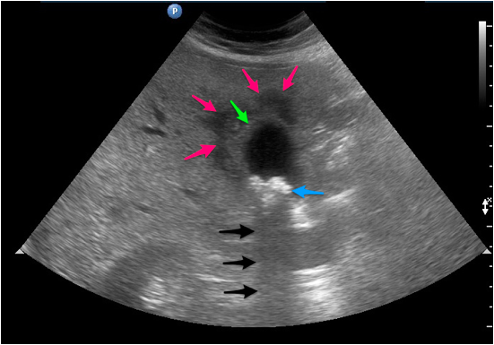

# Ultrasound: Focused Biliary Assessment

**Goals:** Evaluate for gallstones, signs of cholecystitis, dilation of common bile duct (CBD)

**Transducer:** Low-frequency curvilinear or phased-array

**Windows:** 3 windows, can be preformed in any order. Try alternative windows if initial choice unsuccessful.

Figure 1: Transducer positions for gallbladder scan. A: Intercostal, B: Subcostal, C: Lateral. Green line = costal margin. X = xiphoid process.

**1. Intercostal View** 

- Anatomic landmarks: Right midclavicular line at the level of the xiphoid process
- Initial transducer orientation: Transverse with marker towards the patient’s right

**2. Subcostal View** 

- Anatomic landmarks: Right midclavicular line just below the costal margin
- Initial transducer orientation: Sagittal with marker towards the patient’s head

**3. Lateral View** 

- Anatomic landmarks: Right mid or anterior axillary line at the level of the xiphoid process
- Initial transducer orientation: Sagittal with marker towards the patient’s head

_All examinations should include evaluation of the key structures in 2 orthogonal (perpendicular) planes_

## Normal Reference Measurements

**1. Gallbladder wall &le;3 mm** (measure at near-field/superficial wall in longitudinal view)

- **Differential Diagnosis if >3 mm**: 
  - Cholecystitis, heart failure, nephrotic syndrome, hypoalbuminemia, HIV/AIDS, tuberculosis, renal failure, ascites, acute hepatitis, adenomyomatosis, multiple myeloma

**2. Common bile duct &le;5 mm** (can dilate after cholecystectomy & with advanced age) 

- Should be measured from inner wall to inner wall

## Cholelithiasis

Transducer orientation is transverse with marker towards the patient’s right

Figure 2: Cholelithiasis. Note the gallstones with shadowing and normal gallbladder wall thickness

## Acute Cholecystitis

**Signs of cholecystitis:** 

- Gallstones
- Thickened gallbladder wall
- Pericholecystic fluid
- Sonographic Murphy’s sign

Transducer orientation is sagittal with marker towards the patient’s head

Figure 3: Acute cholecystitis. Note the gallstones with shadowing, pericholecystic fluid, and thickened gallbladder wall.

## Struggling with the Exam?

### Can’t find the gallbladder?

- Have the patient sit up and roll onto their left side to improve visualization. Try having the patient take a deep breath and hold it.

### Can’t find the common bile duct (CBD)?

- From the intercostal window, identify the gallbladder in a short axis. Slowly angle the ultrasound beam towards the patient’s head, passing all the way through the gallbladder and continuing upwards. The CBD will be seen in a long axis, just superficial to the portal vein. Use color Doppler to distinguish the CBD from the hepatic artery and portal vein.

### Rib shadows obstructing view?

- Try rotating the probe obliquely to mirror the angle of the intercostal space. If unsuccessful, you can ask the patient to take and hold a deep breath to bring the gallbladder below the ribs.

## Common Errors: Failure to…

- Bowel gas can cause indistinct “dirty” shadowing. Be sure shadows originate from discrete hyperechoic foci (stones) within the gallbladder lumen.
- Edge artifact can cause shadows from the sides of the gallbladder due to refraction.
- Scan all the way through the gallbladder to avoid missing stones in the gallbladder neck or cystic duct, common causes of acute biliary colic and cholecystitis. Be thorough!
- Smaller stones can be missed with some portable ultrasound systems. A comprehensive study may be warranted in cases of moderate/high pre-test probability with a normal point-of-care study.
- Polyps within the gallbladder can often be differentiated from gallstones by changing the patient’s position and assessing for movement. Polyps should remain stationary and gallstones should move with gravity (unless impacted in the neck). Additionally, polyps should not create posterior shadowing as is seen with gallstones.
- Biliary sludge appears as an echogenic layer of fluid without associated posterior shadowing within the gallbladder.

## References

- Summers SM et al. _Ann Emerg Med,_ 2010. PMID: 20138397 [[PubMed](http://www.ncbi.nlm.nih.gov/pubmed/20138397)]
- Blaivas M. et al. _Acad Emerg Med,_ 1999. PMID: 10530660 [[PubMed](http://www.ncbi.nlm.nih.gov/pubmed/10530660)]
