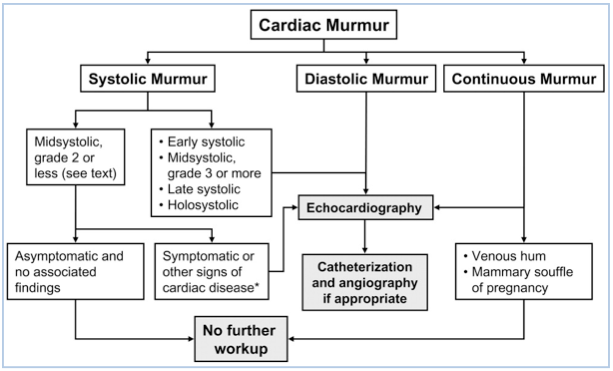

---

title: Murmurs Needing Echocardiography Evaluation
authors:
    - Amy Kinard, RN
created: 2010/09/17
updates: null
categories:
    - Cardiovascular

---

# Murmurs Needing Echocardiography Evaluation

[ACC/AHA 2008 Guidelines](http://www.ncbi.nlm.nih.gov/pubmed/?term=18848134)

## Grading of a Murmur

| **Grade**  |  **Quality and Volume of Murmur**     |
|:-----:|--------------------------------------------------------------|
| I   | Faintest murmur that can be heard (with difficulty)          |
| II  | Murmur also a faint murmur but can be identified immediately |
| III | Murmur moderately loud                                       |
| IV  | Murmur loud and associated with a palpable thrill            |
| V   | Murmur very loud but cannot be heard without the stethoscope |
| VI  | Murmur loudest and can be heard without a stethoscope        |

## Class I (Benefit &gt;&gt;&gt; Risk)

Echo is recommended for:

1.  Asymptomatic patients with diastolic murmurs, continuous murmurs, holosystolic murmurs, late systolic murmurs, murmurs associated with ejection clicks, or murmurs that radiate to the neck or back
2.  Patients with heart murmurs and symptoms or signs of heart failure, myocardial ischemia/infarction, syncope, thromboembolism, infective endocarditis, or other clinical evidence of structural heart disease
3.  Asymptomatic patients with grade 3 or louder mid-peaking systolic murmurs

## Class IIa (Benefit &gt;&gt; Risk)

Echo can be useful for:

1.  The evaluation of asymptomatic patients with (murmurs + other abnormal cardiac physical findings) or (murmurs + abnormal EKG or CXR)
2.  Patients whose symptoms and/or signs are likely non-cardiac in origin but in whom a cardiac basis cannot be excluded by standard evaluation

## Class III (Benefit ≥ Risk)

Echo is NOT recommended for:

1. Patients who have a grade 2 or softer mid-systolic murmur identified as innocent or functional by an experienced observer

## References

-   [Bonow RO et. al.2008 focused update incorporated into the ACC/AHA 2006 guidelines for the management of patients with valvular heart disease: a report of the American College of Cardiology/American Heart Association Task Force on Practice Guidelines (Writing Committee to revise the 1998 guidelines for the management of patients with valvular heart disease). Endorsed by the Society of Cardiovascular Anesthesiologists, Society for Cardiovascular Angiography and Interventions, and Society of Thoracic Surgeons.J Am Coll Cardiol. 2008 Sep 23;52(13):e1-142.](http://www.ncbi.nlm.nih.gov/pubmed/?term=18848134)
