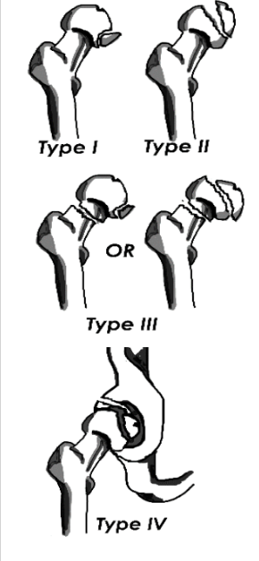

---

title: Hip Injuries - Femoral Head Fracture
authors:
    - Layla Abubshait, MD
    - Michael Gottlieb, MD, RDMS
    - Mary Haas, MD
created: 2016/11/14
updates: null
categories:
    - Orthopedics
---

# Hip Injuries: Femoral Head Fracture

## Xray Views

- AP pelvis
- Lateral hip
- ± Judet view of hip (45-degree oblique)

## Acute Management

Surgery

## Follow-up Timing

Admit and consult an orthopedic surgeon.

## Notes

**Pipkin Classification**

- I: Fracture below fovea/ligamentum (small); Does not involve the weight bearing portion of the femoral head.
- II: Fracture above fovea/ligamentum (larger); Involves the weight bearing portion of the femoral head 
- III: Type I or II with associated femoral neck fracture
- IV: Type I or II with associated acetabular fracture

## References

1. Gill SK, Smith J, Fox R, Chesser TJ. Investigation of occult hip fractures: the use of CT and MRI. Scientific World Journal. 2013;2013:830319. [PubMed](https://www.ncbi.nlm.nih.gov/pubmed/?term=23476147)

2. Rodriguez-Merchan EC, Moraleda L, Gomez-Cardero P. Injuries associated with femoral shaft fractures with special emphasis on occult injuries. Arch Bone Jt Surg. 2013 Dec;1(2):59-63. [PubMed](https://www.ncbi.nlm.nih.gov/pubmed/?term=25207289)
