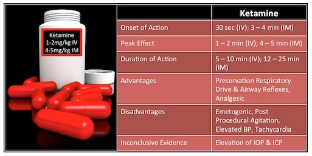
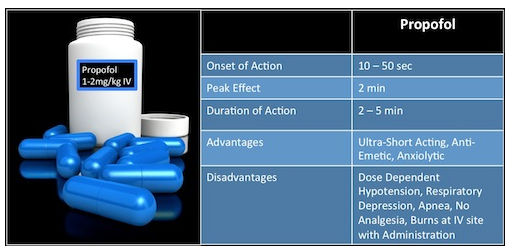

---

title: Ketofol
authors:
    - Salim Rezaie, MD
created: 2013/03/20
updates: null
categories:
    - Pharmacology
---

# Ketamine and Propofol (Ketofol) for Procedural Sedation

**Take Home Points**

-   **Ketofol** is a combination of ketamine and propofol.
-   **Ketamine** gives you a dissociative sedative, analgesic, and amnestic effect.
-   **Propofol** gives you rapid sedation and antiemetic effects. 
-   Overall, it appears that **ketofol** could have a slightly better time to sedation, and length of sedation, but this is not statistically significant based on available evidence. However, it does appear that **ketofol** does have a more steady sedation depth not requiring as many subsequent doses.  
-   More studies needed (it would be great to see a three-armed study comparing ketofol, ketamine, and propofol with appropriate and clinically equivalent dosing for each). 

## KETAMINE BASICS

**Ketamine** is a dissociative anesthetic that is a phencyclidine derivative and provides sedation, analgesia, and amnesia. It works by inhibiting catecholamine uptake, which exerts a sympathomimetic effect.

**Typical dose:** 1–2 mg/kg IV or 4–5 mg/kg IM

-   Additional doses may be required at increments of 0.5-1 mg/kg. 

**Major adverse outcomes:** airway obstruction, hypoxia, apnea, and laryngospasm. 

-   In a meta-analysis, of 8,282 patients, [Green et al (2009)](http://www.ncbi.nlm.nih.gov/pubmed/19201064) stated that the total incidence of these major adverse outcomes was only 3.9%. 
-   Vomiting occurs in about 7–26% of patients.

### What about the elevated intraocular pressure (IOP) and intracranial pressure (ICP) that we are always hearing about?

[Drayna et al (2011)](http://www.ncbi.nlm.nih.gov/pubmed/22169582) found minimal, transient elevations of IOP that were not clinically meaningful. 

-   The largest difference from baseline IOP occurred at 15 minutes with an estimated change of only 1.09 mmHg.

## PROPOFOL BASICS

**Propofol** is a lipophilic, ultra short-acting hypnotic agent, which works by potentiating GABA receptors on the neuronal lipid membranes. It does not provide any analgesia, and therefore should not be used as a sole agent for sedation. Note that one of its advantages is its anti-emetic property with a very low incidence of vomiting.

**Typical dosing:** 1-2 mg/kg bolus followed by either a continuous infusion at 0.05-0.1 mg/kg/min or by 0.5 mg/kg boluses every 2–3 minutes. 
The [Pediatric Sedation Research Consortium looked at 49,836 propofol sedation cases](http://www.ncbi.nlm.nih.gov/pubmed/19201064) and found no instances of death associated with propofol. 

-   CPR was required in 2 cases, aspiration occurred in 4 cases, oxygen desaturation (less than 90% for longer than 30 sec duration) occurred in 716 cases, and central apnea occurred in 143 cases. 

## HOW DO YOU MIX KETOFOL?

No standard dosing regimen established.

Most studies and authors recommend a **1:1 ratio** to provide ease of administration. The medications can be mixed or given sequentially. 

**[Click here for full ALiEM blog post](https://www.aliem.com/2013/ketofol-game-changer-procedural-sedation/)**

## References

-   [P.C. Drayna, C. Estrada, W. Wang, B.R. Saville, and D.H. Arnold, "Ketamine sedation is not associated with clinically meaningful elevation of intraocular pressure.", The American journal of emergency medicine, 2011.](http://www.ncbi.nlm.nih.gov/pubmed/22169582)
-   [J.P. Cravero, M.L. Beach, G.T. Blike, S.M. Gallagher, J.H. Hertzog, and . , "The incidence and nature of adverse events during pediatric sedation/anesthesia with propofol for procedures outside the operating room: a report from the Pediatric Sedation Research Consortium.", Anesthesia and analgesia, 2009.](http://www.ncbi.nlm.nih.gov/pubmed/19224786)
-   [M.J. Alletag, M.A. Auerbach, and C.R. Baum, "Ketamine, propofol, and ketofol use for pediatric sedation.", Pediatric emergency care, 2012.](http://www.ncbi.nlm.nih.gov/pubmed/23222112)
-   [A. Shah, G. Mosdossy, S. McLeod, K. Lehnhardt, M. Peddle, and M. Rieder, "A blinded, randomized controlled trial to evaluate ketamine/propofol versus ketamine alone for procedural sedation in children.", Annals of emergency medicine, 2010.](http://www.ncbi.nlm.nih.gov/pubmed/20947210)
-   [J.A. Payne, C. Lytle, and T.J. McManus, "Foreign anion substitution for chloride in human red blood cells: effect on ionic and osmotic equilibria.", The American journal of physiology, 1990.](http://www.ncbi.nlm.nih.gov/pubmed/2240195)
-   [Andolfatto, Gary, et al. "Ketamine-propofol combination (ketofol) versus propofol alone for emergency department procedural sedation and analgesia: a randomized double-blind trial." Annals of emergency medicine 59.6 (2012): 504-512.](http://www.ncbi.nlm.nih.gov/pubmed/22401952)
-   [S.M. Green, M.G. Roback, B. Krauss, L. Brown, R.G. McGlone, D. Agrawal, M. McKee, M. Weiss, R.D. Pitetti, M.A. Hostetler, J.E. Wathen, G. Treston, B.M. Garcia Pena, A.C. Gerber, J.D. Losek, and . , "Predictors of airway and respiratory adverse events with ketamine sedation in the emergency department: an individual-patient data meta-analysis of 8,282 children.", Annals of emergency medicine, 2009.](http://www.ncbi.nlm.nih.gov/pubmed/19201064)
