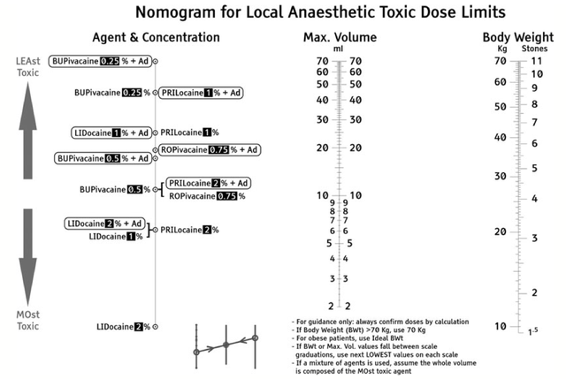

# Local Anesthetic Toxicity: Calculating Maximum Safe Dose

## Nomogram Instructions

1. Use ideal body weight (IBW). If IBW >70 kg, use 70 kg dosing.
2. If multiple local anesthetics (LAs) are used, calculate maximum dose assuming LA with greatest toxicity is used alone.
3. Identify administered LA under “Agent & Concentration”
4. Draw a line between LA Agent & Concentration (left) to patient´s IBW (right).
5. Where this line intersects “Max Volume” (center) is the maximum dose (mL) that can be safely administered to the patient.
6. These numbers assume that the toxic levels are:

  - Bupivacaine = 2 mg/kg
  - Lidocaine = 3 mg/kg
  - Lidocaine + “Ad”renaline (Epinephrine) = 6 mg/kg

## Dosing of 20% INTRAVENOUS LIPID for local anesthetic toxicity

- Draw a **vertical line** downward from patient´s IBW. 
- The intersection of this line with the 3 other axes indicate weight-based initial bolus volume, infusion rate, and total maximum dose of intralipid (20%).

## References

- Williams DJ, Walker JD. A nomogram for calculating maximum dose of local anaesthetic. Anaesthesia 2014. PMID 24820093

Click here [[Source](https://www.aliem.com/2014/pv-card-local-anesthetic-toxicity-calculations/)] for full ALiEM blog post
