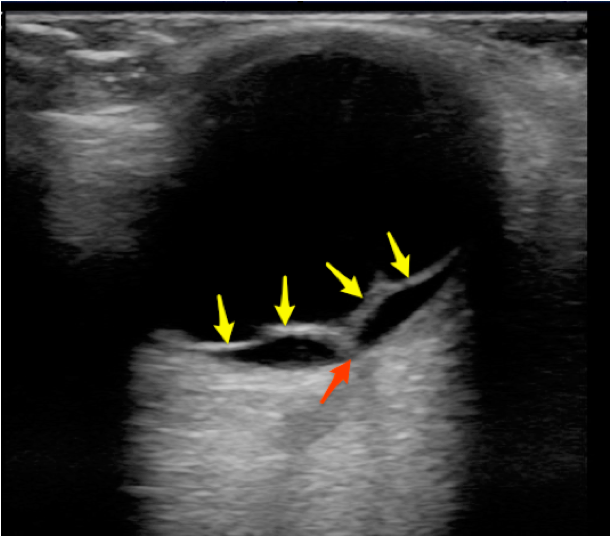
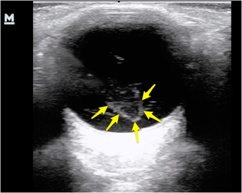
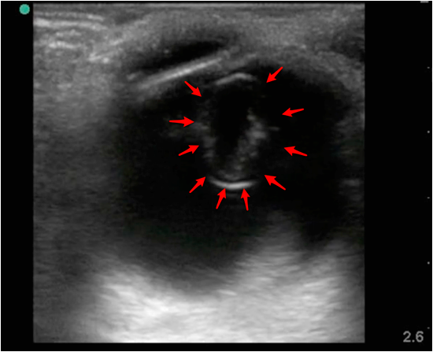
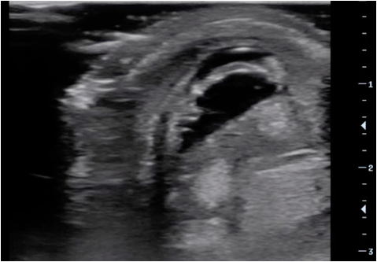

# Ultrasound: Ocular Assessment

**Goals:** Evaluate for retinal/vitreous detachment, retinal/vitreous hemorrhage, lens dislocation, ocular foreign body, and globe rupture

**Transducer:** High frequency linear transducer. If available, the _ophthalmologic, superficial_, or _small parts_ preset should be selected on the machine.

**Patient Position:** With the patient’s eye closed, apply a bio-occlusive dressing (e.g. Tegaderm) over the closed eyelid to serve as a barrier. Apply a generous amount of gel over the dressing.

**Windows:** Visualize the eye in 2 planes:

1. **Longitudinal View**

  - Commence at the midline of the eye. 
  - The directional indicator is oriented towards the vertex of the skull. 
  - Stabilize the transducer by resting your hand against the bridge of the patient’s nose or eyebrow, taking care not to apply any more pressure to the globe than is necessary to obtain adequate contact. 
  - The transducer should be ‘fanned’ from left to right to visualize the entire globe.

2. **Transverse View** 

  - Rotate the transducer 90 degrees, with the directional indicator oriented towards the patient’s right, and visualize the globe in a second plane. 
  - The transducer should be ‘fanned’ up and down in order to properly visualize all structures of the eye.

**Tip:** The contralateral, or ‘unaffected’ eye may be scanned in an identical manner to compare ocular anatomy.

## Normal Eye

Figure 1: Normal eye

- **Anterior chamber** (a): Located between hyperechoic cornea anteriorly and **iris** posteriorly
- **Lens** (L): Biconvex hyperechoic structure posterior to the anterior chamber (a).
- **Vitreous chamber** (v): Is hypoechoic and encompasses most of the globe and the **retina** adheres to its posterior surface
- **Optic nerve sheath** (n): Appears as a hypoechoic linear structure deep to the vitreous chamber

## Ocular Pathologies

## Detachments

- **Retinal:** Generally remains anchored to the optic disc in most posterior section of the eye; appears as a hyperechoic membrane floating in the vitreous chamber
- **Vitreous:** May be difficult to distinguish from a retinal detachment; may have a V-shaped appearance, similar to retinal detachment, but is generally less intensely OOhyperechoic and is better visualized with a higher gain setting.

## Hemorrhage 
- Retinal vs vitreous often difficult to distinguish from each other.
- Hemorrhages will look like echogenic opacities in the vitreous chamber.

## Lens dislocation 
- Biconvex or round hyperechoic structure (lens) is displaced from its normal position. 
- With eye movement it may appear to move independently of surrounding structures.

## Foreign body 
- A hyperechoic object typically located in the vitreous chamber, but may also be embedded into the retina or posterior orbit. 
- Depending on its composition, the foreign body may cause posterior acoustic shadowing, similar to gallstones.

## Globe rupture 
- Very abnormal shape 
- **Clues:** Collapsed anterior chamber, irregularly shaped posterior chamber, scleral buckling, large vitreous hemorrhage

## Retinal Detachment

Figure 2: The detached **retina** appears as a thick, hyperechoic band in the vitreous chamber, anchored posteriorly to the **optic disc**.

## Vitreous Hemorrhage

Figure 3: Vitreous hemorrhage - area of **hemorrhage** is visible as faint echogenic material causing a heterogeneous appearance to the chamber. Note the higher gain setting used.

## Lens Dislocation

Figure 4: Lens dislocation - The **lens** is seen floating en face in the vitreous chamber.

## Globe Rupture

Figure 5: Globe rupture - irregular globe contour with collapsed anterior chamber. Echogenic material fills the vitreous chamber.

## Struggling with the Exam?

### Can’t visualize the eye adequately?

- Increase the amount of gel on the bioocclusive dressing, as this ‘evens out’ the surface of the eye for the transducer.

### Unsure if there is pathology in the vitreous chamber?

- In order to adequately assess the vitreous chamber for detachment or hemorrhage, the eye should be examined with both moderate AND high gain settings. Evaluate in a fixed forward gaze AND while the patient performs extraocular movements (kinetic echography).

### Is it ever unsafe to perform the exam?

- Ocular ultrasound is contraindicated if there are obvious signs of open ocular trauma or globe rupture. Discontinue the examination if there are sonographic findings of globe rupture or retrobulbar hematoma.

## Pearls

- Apply a generous amount of conducting gel to the closed eyelid/film dressing to optimize image quality.
- Do not miss abnormal structures in the normally anechoic vitreous chamber due to inadequate gain settings.

## Limitations

- Bedside ultrasound is of limited utility for the evaluation of the bony anatomy of the orbit. If fractures of the bony orbits are suspected, a maxillofacial CT is the test of choice.
- CT imaging is more sensitive in the detection of radio-opaque foreign bodies, particularly those that have penetrated through the globe.

## References

- Blaivas M, et al. _Acad Emerg Med_, 2002. PMID: 12153883 [[PubMed](http://www.ncbi.nlm.nih.gov/pubmed/?term=12153883)]
- Kimberly HH, et al. _Acad Emerg Med_, 2008. PMID: 18275454 [[PubMed](http://www.ncbi.nlm.nih.gov/pubmed/18275454)]
