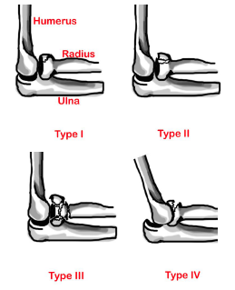

---

title: Elbow Injuries - Radial Head Fracture
authors:
   - Melody Glenn, MD
   - Andrew Little, DO
   - Mary Haas, MD
created: 2016/12/12
updates: null
categories:
   - Peer Reviewed
   - Orthopedics

---

# Elbow Injuries: Radial Head Fracture

## X-ray Views

**Elbow XR:** AP, lateral, +/- radiocapitellate view.

Assess for indirect signs of fx or DL on lateral elbow view.
- Sail sign or posterior fat pad; radiocapitellate line misalignment

## Acute Management

**Type I:** Sling.
**Type II-IV:** Long-arm posterior splint with elbow at 90° flexion (with type IV elbow dislocation reduced).

## Follow-up Timing

### Operative indications
- &gt;3 mm displacement.
- 33% articular surface involvement.
- Angulated >30&deg;.
- Associated elbow dislocation.

### Orthopedic follow-up timing
- &ge;3 days (if operative).
- $gt;1-2 weeks with early mobilization in 48 hours to minimize elbow stiffness.

## Notes

### Mason Classification

| Type | Description                                        |
| ---- | -------------------------------------------------- |
| I    | Minimally displaced fracture &ge;2 mm              |
| II   | Fracture fragment displaced &gt;2 mm or angulated  |
| III  | Comminuted and displaced fracture                  |
| IV   | Associated elbow dislocation                       |

Most common elbow fractures in adults.

## References

- Wheeless’ Textbook of Orthopaedics  [Link](http://Wheelessonline.com)
- Orthobullets  [Link](http://OrthoBullets.com)
- Radiopaedia  [Link](http://Radiopaedia.org)
- General Guidelines For Management for Orthopedic Injuries card by the Nationwide Children’s Hospital, Dept of Orthopedics.
