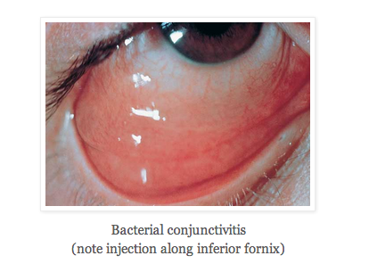
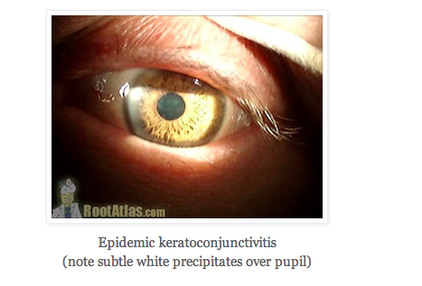
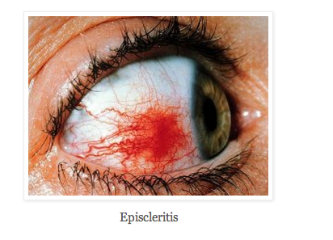
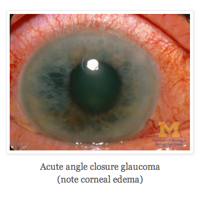

---

title: 'Red Eye'
authors:
    - 'Michelle Lin, MD'
created: 2010/01/22
updates: null
categories:
    - Ophthalmology
drugs: 'trifluridine, vidarabine, acyclovir, erythromycin, Azithromycin, timolol, prednisolone, apraclonidine, acetazolamide'

---

# Red Eye

## Conjunctivitis

### Allergic

-    IgE mediated, usually associated with itching
-   **Treatment:** Cold compresses, OTC topical vasoconstrictors, histamine-blocking eyedrops

### Viral

-   Most common form of infectious conjunctivitis (usually adenovirus)
-   Preauricular lymphadenopathy, global conjunctival injection
-   Watery discharge
-   Follicular reaction ofinferior tarsal conjunctiva
- **Treatment:** Cold compresses, artificial tears, topicaldecongestants, +/- topical abx, if not able to discern from bacterial etiology

### Viral: Epidemic keratoconjunctivitis

-   Adenovirus
-   Symptoms: Eye pain, decreased visual acuity
-   Findings: corneal subepithelial infiltrates (1-2 mm gray-white crumb-like defects)

### Viral: HSV conjunctivitis

-   More prevalent in HIV pts. Foreign body sensation in eye (unlike typical viral conjunctivitis)
-   **Treatment**:
  - If no skin or corneal involvement, topical antivirals(trifluridine or vidarabine) x 10-14 days
  -   If corneal involvement (dendrites seen), topical trifluridine and oral acyclovir x 7-10 days. NO STEROIDS. 

### Viral: HZV ophthalmicus

VZV virus: Reactivation through V1 nerve. 
Findings:
-   Hutchinson sign = herpes pustules at nose tip and is predictive of ocular involvement. 
-   Dendrites on eye exam
- **Treatment:** Systemic vs topical antiviral agents, +/- steroids only with ophtho consult

### Bacterial 

Often association with morning crusting. Injection more pronounced at fornices. 
**Contact lens wearer**: Pseudomonas risk.
-   **Treatment:** topical fluoroquinolone, cycloplegic

**Gonorrheal conjunctivitis:** sexually active patients and neonates (from birthcanal), “hyperacute conjunctivitis”, abrupt onset, copious purulent discharge. 
-   **Treatment:** Topical abx, usually with systemic abx because associated with venereal disease

**Inclusion conjunctivitis**
-   Chlamydia: Sexually active patients and neonates,mucopurulent discharge, FB sensation
-   Check for concurrent STI(symptomatic only 1⁄2 patients).
-   **Treatment:** Topical erythromycin and po azithromycin x 1 

## Subconjunctival Hemorrhage

-   In setting of trauma and large hemorrhage, consider globe rupture
-   **Treatment:** Warm compresses, lubrication drops 

## Episcleritis

-   Episclera = thin membrane over the sclera and beneath conjunctiva
-   Benign self-limited inflammatory cond with focal area of dilated episceral vessels 
-   Seen with RA, PAN, lupus, inflam bowel disease, sarcoid, Wegener’s, gout, HZV, syphilis 
-   **Treatment:** NSAIDs po

## Scleritis

-   Most common immune cause = RA
-   Most common vasculitis cause = Wegener’s 
-   Symptoms: Severe eye pain radiating to ear, scalp, face, and jaw. Dull pain. Photophobia. 
-   Exam: Deep episcleral plexus is vascularly engorged – appears blue-violet, vessels non-blanching with vasoconstrictor, scleral edema 
-   **Treatment:** NSAIDs po +/- steroids po per ophtho consultation 

## Uveitis

-   Divided into anterior (iris, ciliary body) vs posterior (retinochoroiditis)
-   Etiologies: Inflammatory (50% assoc w/ systemic inflam disease), traumatic, infectious 
-   Consider CMV in posterior uveitis in HIV patients
-   **Anterior uveitis:** Sudden, severe, painful eye; photophobia; perilimbal injection, consensual photophobia from unaffected eye
-   **Posterior uveitis:** “Floaters”, flashing light – no redness or pain
-   Exam: Inflammatory cells, proteinaceous flare
-   Complications: Cataracts, glaucoma, retinal detachment
-   **Treatment:** Mydriatic or cycloplegic drops +/- steroids po only with ophtho consult 

## Acute Angle Closure Glaucoma

-   Symptoms: Blurred vision, halos around lights, N/V, HA
-   Pearl: Consider in all patients with “migraine HA’s” – check pupil reactivity
-   Exam: Corneal edema, mid-dilated NON-reactive pupil
-   IOP with &gt; 30 mmHg requires prompt treatment
-   **Treatment:** Topicals - timolol, prednisolone, apraclonidine; Oral - acetazolamide 

## References

-   [Mahmood AR, Narang AT. Diagnosis and management of the acute red eye.Emerg Med Clin North Am. 2008 Feb;26(1):35-55, vi. doi: 10.1016/j.emc.2007.10.002.](http://www.ncbi.nlm.nih.gov/pubmed/?term=18249256)
