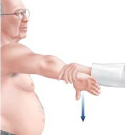
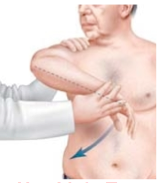
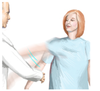
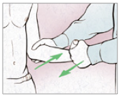
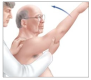
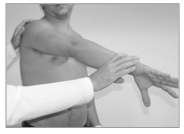
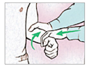

---

title: Shoulder Exam Provocative Testing
authors:
    - Michelle Lin, MD
created: 2011/01/28
updates:
categories:
    - Orthopedics
---

# Shoulder Exam Provocative Testing

## Supraspinatus muscle injury

### Jobe's Test ("Empty Can" Test)

1. Position arm in scapular plane and point thumb down as if emptying out can.
2. Examiner pushes down on arm.

### Hawkin's Test
1. Position arm in throwing position and flex forward 30 degrees.
2. Examiner internally rotates humerus.

      

### Drop Arm Test

1. Position patient's arm fully abducted so hand is over the head.
2. Ask patient to slowly adduct arm to their side.
3. If supraspinatus muscle is torn, at &lt; 90 degrees the arm will suddenly drop.

## Infraspinatus muscle injury

90% of shoulder external rotation uses infraspinatus muscle. 

### Infraspinatus scapular rotation test

Patient has pain when externally rotates shoulder against resistance (with elbow in 90 degree flexion)

## Subscapularis muscle injury

### Lift-off test

1. Position patient's hand behind the back of waist level with palm facing out
2. Ask patient to move arm away from body against examiner resistance

## Rotator cuff subacrominal impingement

### Neer Test

1. With the arm fully pronated, the examiner raises the arm above the patient's head in forward flexion movement
2. Stabilize the scapula to prevent scapulothoracic motion

## Labral tear

### Crank Test

1. Position patient's arm in 90 degree abduction and elbow flexion
2. Examiner pushes humerus into glenohumeral joint while internally and externally rotating arm

 

### O'Brien Test

1. Position patient's shoulder in 90 degree flexion, elbow extended, and 14 degrees adducted (medial to sagittal plane)
2. Point thumb down
3. Examiner stand behind pateint and applies downward force
4. Repeat with arm supinated (thumb up)
5. If pain is elicited in first maneuver only, then suggests labral tear (if pain "inside" shoulder) or AC joint abnormality (if pain "on top" of shoulder)

## Bicep muscle injury

### Yergason Test

1. Position patient's elbow at 90 degrees with thumb up
2. Have the patient supinate and flex elbow against examiner's resistance (holding at wrist)

## References

- Levine W. Shoulder Exam. Orthobullets [Link](http://www.orthobullets.com/sports/3037/shoulder-exam)
