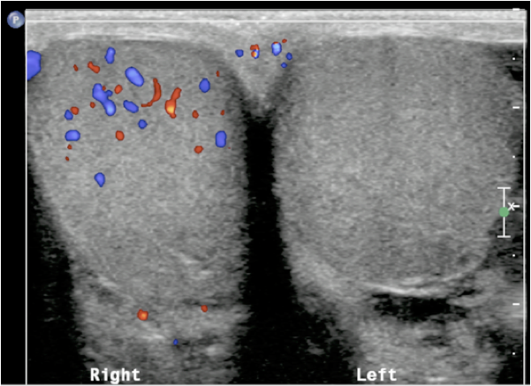
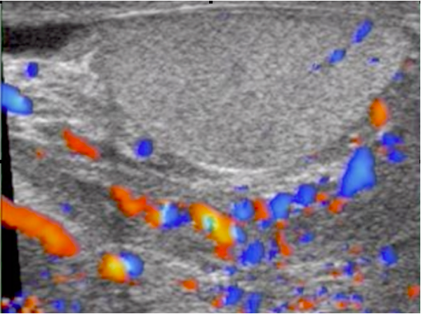

# Ultrasound: Testicular Assessment

**Goals:** Evaluate for testicular torsion, orchitis, and epididymitis

**Transducer:** High-frequency linear transducer

**Pt Position:**    Frog-leg position with sling of towels underneath scrotum

**Windows:**

1. **Transverse** **survey** of each testicle: Directional indicator oriented to patient’s right
2. **Longitudinal** **survey** of each testicle: Directional indicator oriented to patient’s head. The epididymis will be located posterolaterally to the testicle
3. **Doppler**: Color flow or Power Doppler of each testicle looking for flow and comparing each side. Begin with the unaffected testicle and adjust color gain to have a small but visible amount of flow. Then move to the affected testicle and compare flow with the same settings. Comparison of both sides is critical.
4. **Single midline view** of both testicles side by side if possible, both with and without color for comparison.

## Color and Flow Comparison

- Always compare flow relative to unaffected testicle.
- Decreased or absent flow in the affected testicle suggests **torsion**

Figure 1: Left testicular torsion - midline transverse view demonstrating absent flow

## Color and Flow Comparison (cont’d)

- Increased flow in the affected testicle or epididymis suggests orchitis and/or epididymitis (or a recently detorsed testicle if clinically consistent). 
- Isolated orchitis is rare, **epididymitis** most common diagnosis.

Figure 2: Acute epididymitis - longitudinal view demonstrating increased color flow in the body of the epididymis

## Advanced Assessment

If unclear, consider pulse wave Doppler to identify both arterial and venous flow as early torsion will have arterial flow but absent venous flow.

Torsion cannot be excluded with ultrasound, although a normal comprehensive spectral Doppler assessment makes torsion very unlikely. Normal testicular resistive indices range from 0.5 to 0.8.

## References

- Blaivas M, Sierzenski P. _Acad Emerg Med_, 2001. PMID: 11136158 [PubMed](http://www.ncbi.nlm.nih.gov/pubmed/11136158)
- Blaivas M, et al. _Acad Emerg Med_, 2001. PMID: 11136159 [PubMed](http://www.ncbi.nlm.nih.gov/pubmed/11136159)
