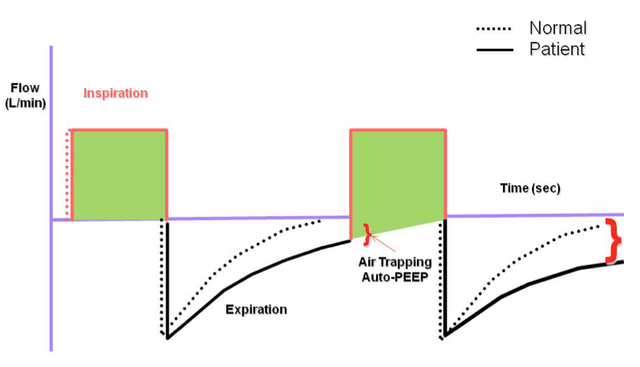

# Ventilator Setting for Obstructive Lung Disease

## Goal in obstruction (asthma/COPD)

Give the patient time to exhale

Initial vent settings for patient with predicted Ideal Body Weight (IBW) = 70 kg (5'9" male; 5'11" female)

<table>
<colgroup>
<col width="50%" />
<col width="50%" />
</colgroup>
<tbody>
<tr class="odd">
<td><ul>
<li>Mode = Volume Assist Control (AC)</li>
<li>Tidal volume = 560 mL</li>
<li>Inspiratory flow rate = 80 L/min</li>
<li>Respiratory rate = 10</li>
</ul></td>
<td><ul>
<li>FiO2 = 100%</li>
<li>PEEP = 0-5</li>
<li>Goal Pplt &lt; 30 cmH2O</li>
</ul></td>
</tr>
</tbody>
</table>

## Ventilator Mode

Volume Assist Control (AC)

## Tidal Volume (Vt)

8 mL/kg Based on ideal body weight (kg)

## Inspiratory Flow Rate (IFR)

80-100 L/min

- Increase IFR and ensure adequate sedation if patient uncomfortable or sucking on tube

## Respiratory rate (RR)

Start at 10, then adjust to give time to exhale **(IMPORTANT)**

- Goal I:E of 1:4 or 1:5
- Permissive hypercapnea, as long as pH stays above 7.2
- Prevents air-trapping/auto PEEP

## FiO2 & PEEP

Start at FiO2 100% and PEEP 0-5

- Goal SpO2 = 92-95%
- Can usually quickly titrate down the FiO2

## Plateau Pressure (Pplt)

- Goal Pplt &lt;30 cm H2O
- Check after initial settings and at regular intervals thereafter
- Technique: Press inspiratory hold button for 0.5 sec and look at pressure gauge 
- If Pplt >30 cm H2O, investigate possible air trapping

## Air-Trapping (Auto-PEEP)

- Air trapping (auto-PEEP) = gas trapped in alveoli at end-expiration
- Suspect auto-PEEP if P(plat) >30 cm H2O, or if hypotension develops
- First step is to disconnect vent and allow trapped air to escape
- Prevent further air trapping by decreasing RR and increasing expiratory time

_[EMcrit.org](http://emcrit.org/podcasts/vent-part-2/)_

## References

- www.EMcrit.org(www.EMcrit.org)
- Brenner B, Corbridge T, Kazzi A. Intubation and mechanical ventilation of the asthmatic patient in respiratory failure. J Emerg Med. 2009 Aug;37(2 Suppl):S23-34. doi: 10.1016/j.jemermed.2009.06.108. [PubMed](https://www.ncbi.nlm.nih.gov/pubmed/19683662/)
